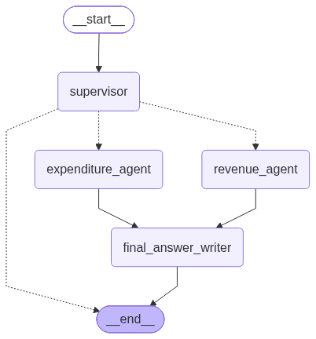

# HTX Take Home Assignment - Submission by Chew Xuan Yu

## Setup Instructions

Using a command line terminal:

| Step 	|                       Description                       	  |         Command Line Example         	|
|:----:	|:-----------------------------------------------------------	|:------------------------------------	|
|   1  	| Create and activate Python 3.13 virtual environment     	  | conda create -n htx_case python=3.13 	|
|   2  	| Navigate to main folder of submission (/htx_take_home_case) | cd ./download/htx_take_home_case     	|
|   3  	| Update pip to latest version                            	  | pip install --upgrade pip            	|
|   4  	| Install packages listed in requirements.txt             	  | pip install -r requirements.txt      	|
|   5  	| Start Jupyter Notebook or open folder with Visual Studio Code (Development IDE)                                    	| jupyter notebook                     	|

The notebooks are meant to be run in sequence based on the numbering. If the persisted Chroma DB exists, part1_1_ingest_doc.ipynb can be skipped. Otherwise, it needs to be run to create the data store required by every other notebook.

### Part 1: Document Extraction & Prompt Engineering
#### Task 1 Parsing
Document extraction is encapsulated in 'part1_1_ingest_doc.ipynb'.

Similar to production data pipelines, ingestion is intended to be seperate from subsequent application or model processes. The seperation enables testing during development without repeating the intensive ingestion process.

More time was spent on this task than others in other to setup a good RAG foundation. The main challenge for ingesting this document was the high proportion of pages with tables and figures and the fact that key information often resided in tables.

After some testing against pages 8, 20, 32 and 33, the camelot library with transformer model based parsing proved to yield the best results.

To summarize the process:

- Manually identify pages with tables (no perfect library)
- for each page:
    - if page has table:
        - Convert each row into RAG-friendly text chunks
        - Combine with text and metadata outside tables
    - if page has no table:
        - recursive text splitter
        - hierarchical chunking not done due to time constriants

#### Task 2 Prompt Engineering for Extraction
Completed in 'part1_2_RAG_results.ipynb' with prompts stored in 'prompt_templates.py' for code organization.

XML format prompts requesting for JSON format outputs were used based on past experience.

Single LangChain retrieval chains with the same prompt are sufficient to extract each of the fields.

Hybrid retrieval using Best Matching 25 (BM25) was implemented to improve the results after some testing. A Reranker model could be added but the results appeared good enough.

There is some ambiguity if 2024 or 2023 numbers are required based on the contents of page 5, but the solution is able to extract both accurately from different pages.

### Part 2: Tool Calling & Reasoning Integration
Both tasks are completed in 'part2_1a_date_extraction_decorator.ipynb' or 'part2_1b_date_extraction_mcp.ipynb' - 1a uses a LangChain tool decorator while 1b uses a local MCP server for the tool.

The local MCP server can be started as a normal python process (python part2_mcp_server.py) in the same virtual environment. The server should usually have its own environment but it is combined here for testing convenience since there is only one simplistic tool.

Date normalisation was completed through prompt engineering with reasoning while date categorization is handled by the tool. Thresholds on date categorization can be adjusted in terms of days.

### Part 3: Multi-Agent Supervisor
This part is completed in 'part3_1_supervisor_graph.ipynb' using LangGraph.

4 agents are used to complete the workflow:

- Supervisor agent which reads the user query and detects the intent before routing to one or both of the 2 specialized agents.
- Revenue Agent that focuses on revenue related information and generates RAG analysis for the final agent.
- Expenditure Agent that focuses on expenditure related information and generates RAG analysis for the final agent.
- Answer Writer Agent that takes in the analyses of the specialized agents to compile the final answer. This task is seperated from the Supervisor agent for stability and simpler graph state management.

Light tracing of the nodes and routing involved is implemented and stored as part of the graph state.

#### [Note]
The solutions require automated downloads of open source models from HuggingFace. Please let me know if there are any hardware constrains and I can switch to smaller models or loading models from local files if required.

Kindly let me know if there are any issues, thank you.